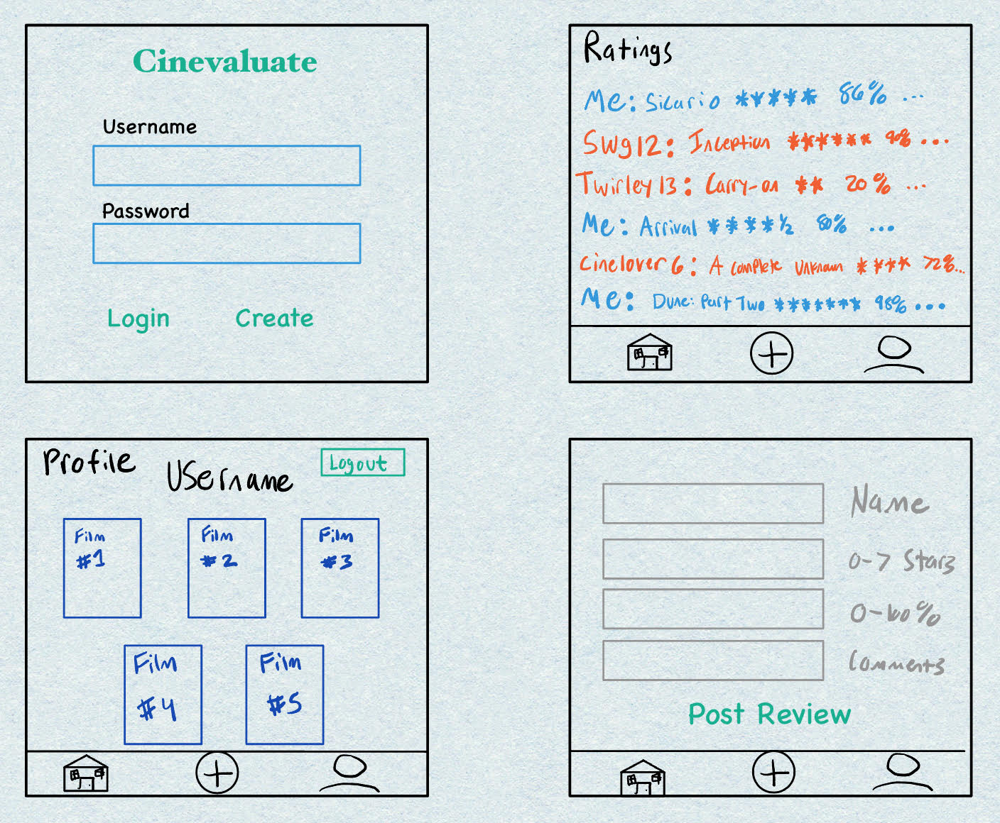

# Cinevaluation

Cinevaluation is a movie review platform where users can rate, review, and share their opinions on films. Users can create personalized lists of their all-time favorite movies, organized by genre or theme. With the ability to see friends’ ratings and reviews in real time, Cinevaluation makes sharing and discovering new movies easy and enjoyable.

## 🚀 Specification Deliverable

### Elevator pitch
Have you ever been asked about your favorite movies or cinematic moments, only to draw a blank? Cineview is the ultimate app for movie enthusiasts. It allows users to rate and review every film they watch, create personalized lists of their all-time favorites, and share their thoughts with friends in real time. With features such as liking, commenting, and following friends’ reviews, Cineview is more than just a review platform—it’s a social hub for cinema lovers. Whether you're deciding what to watch next or curating your ultimate favorites, Cineview makes the process seamless, social, and fun.

### Design

### Key features

- Log in or create an account to access app features.
- Rate movies using a 7-star and 0-100% scale.
- View user and friend reviews updated instantly.
- Add comments and opinions on movies you review.
- Move seamlessly between the home, review, and account pages.
- Create and share personalized top-5 movie lists.
- Search for movies using a public movie database API.

### Technologies

I am going to use the required technologies in the following ways.

- **HTML** - The well structured backbone for the application, used to organize the content. Key pages such as the login or register page, user profile page, and movie rating and review page. Hyperlinks will be included to navigate across the app.
- **CSS** - Basic stylistic features and color schemes will be handled with CSS. Fonts, whitespace, positioning and decoration.
- **Javascript** - API requests for movie data and reviews, and real-time updates using WebSockets to display friends’ reviews instantly.
- **React** - Movie review and rating components, list of favorite movies and user login interactions.
- **Service** - Backend service endpoints for:
    - login
    - making reviews
    - movie database (public API)
    - movie recommendations
- **DB / Login** - User login information is stored in a secure database, users will also not be allowed to review movies without signing up. 
- **Websocket** - As the users enter their movie reviews, their friends can see them real time and vice versa. 

## 🚀 AWS deliverable

For this deliverable I did the following. I checked the box `[x]` and added a description for things I completed.

- [ ] **Server deployed and accessible with custom domain name** - [My server link](https://yourdomainnamehere.click).

## 🚀 HTML deliverable

For this deliverable I did the following. I checked the box `[x]` and added a description for things I completed.

- [ ] **HTML pages** - I did not complete this part of the deliverable.
- [ ] **Proper HTML element usage** - I did not complete this part of the deliverable.
- [ ] **Links** - I did not complete this part of the deliverable.
- [ ] **Text** - I did not complete this part of the deliverable.
- [ ] **3rd party API placeholder** - I did not complete this part of the deliverable.
- [ ] **Images** - I did not complete this part of the deliverable.
- [ ] **Login placeholder** - I did not complete this part of the deliverable.
- [ ] **DB data placeholder** - I did not complete this part of the deliverable.
- [ ] **WebSocket placeholder** - I did not complete this part of the deliverable.

## 🚀 CSS deliverable

For this deliverable I did the following. I checked the box `[x]` and added a description for things I completed.

- [ ] **Header, footer, and main content body** - I did not complete this part of the deliverable.
- [ ] **Navigation elements** - I did not complete this part of the deliverable.
- [ ] **Responsive to window resizing** - I did not complete this part of the deliverable.
- [ ] **Application elements** - I did not complete this part of the deliverable.
- [ ] **Application text content** - I did not complete this part of the deliverable.
- [ ] **Application images** - I did not complete this part of the deliverable.

## 🚀 React part 1: Routing deliverable

For this deliverable I did the following. I checked the box `[x]` and added a description for things I completed.

- [ ] **Bundled using Vite** - I did not complete this part of the deliverable.
- [ ] **Components** - I did not complete this part of the deliverable.
- [ ] **Router** - Routing between login and voting components.

## 🚀 React part 2: Reactivity

For this deliverable I did the following. I checked the box `[x]` and added a description for things I completed.

- [ ] **All functionality implemented or mocked out** - I did not complete this part of the deliverable.
- [ ] **Hooks** - I did not complete this part of the deliverable.

## 🚀 Service deliverable

For this deliverable I did the following. I checked the box `[x]` and added a description for things I completed.

- [ ] **Node.js/Express HTTP service** - I did not complete this part of the deliverable.
- [ ] **Static middleware for frontend** - I did not complete this part of the deliverable.
- [ ] **Calls to third party endpoints** - I did not complete this part of the deliverable.
- [ ] **Backend service endpoints** - I did not complete this part of the deliverable.
- [ ] **Frontend calls service endpoints** - I did not complete this part of the deliverable.

## 🚀 DB/Login deliverable

For this deliverable I did the following. I checked the box `[x]` and added a description for things I completed.

- [ ] **User registration** - I did not complete this part of the deliverable.
- [ ] **User login and logout** - I did not complete this part of the deliverable.
- [ ] **Stores data in MongoDB** - I did not complete this part of the deliverable.
- [ ] **Stores credentials in MongoDB** - I did not complete this part of the deliverable.
- [ ] **Restricts functionality based on authentication** - I did not complete this part of the deliverable.

## 🚀 WebSocket deliverable

For this deliverable I did the following. I checked the box `[x]` and added a description for things I completed.

- [ ] **Backend listens for WebSocket connection** - I did not complete this part of the deliverable.
- [ ] **Frontend makes WebSocket connection** - I did not complete this part of the deliverable.
- [ ] **Data sent over WebSocket connection** - I did not complete this part of the deliverable.
- [ ] **WebSocket data displayed** - I did not complete this part of the deliverable.
- [ ] **Application is fully functional** - I did not complete this part of the deliverable.
